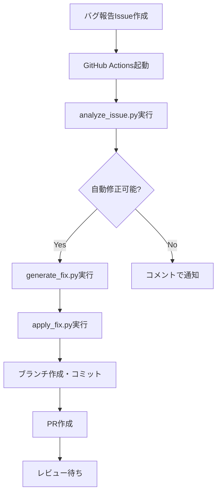

# 自動バグ修正機能

## 概要

Delax100DaysWorkoutアプリには、GitHub Issueとして報告されたバグを自動的に分析し、可能な場合は修正を試みる機能が実装されています。この機能はClaude AIを使用して、安全で信頼性の高い修正を生成します。

## 機能の流れ



## 自動修正可能なバグの種類

### 1. ボタンが効かない（button_not_working）
- nil参照エラー
- セレクタの不一致
- バインディングの問題

### 2. 表示がおかしい（display_issue）
- レイアウト制約の問題
- 色やフォントの問題
- 表示/非表示の制御

### 3. nil参照エラー（nil_reference）
- オプショナルバインディングの欠如
- ガード文の追加が必要な箇所
- デフォルト値の設定

## 自動修正されないケース

以下の場合、自動修正は行われません：

1. **ビジネスロジックの変更が必要**
2. **データモデルの変更が必要**
3. **複雑な状態管理の修正**
4. **3ファイル以上の変更が必要**
5. **100行以上の変更が必要**
6. **認証情報やセキュリティに関わる変更**

## 使い方

### 1. バグを報告する

アプリ内でシェイクジェスチャーを使用してバグ報告画面を開き、以下の情報を入力：

- カテゴリを選択
- 問題の説明
- 再現手順（任意）
- 期待される動作（任意）
- 実際の動作（任意）

### 2. GitHub Issueの作成

バグ報告が送信されると、自動的にGitHub Issueが作成されます。

### 3. 自動分析

`auto-fix-candidate`ラベルが付いたIssueは自動的に分析されます。

### 4. 修正の生成と適用

修正可能と判断された場合：
1. 修正コードが生成される
2. 新しいブランチが作成される
3. 修正が適用される
4. PRが作成される

### 5. レビューとマージ

生成されたPRは人間によるレビューが必要です。

## 安全性

### 禁止されているパターン

以下のパターンを含む修正は自動的に拒否されます：

- `password`, `secret`, `token`, `api_key`（大文字小文字区別なし）
- `rm -rf`, `sudo`, `chmod 777`
- `DROP TABLE`, `DELETE FROM`, `TRUNCATE`

### 制限事項

- 最大3ファイルまでの変更
- 最大100行までの変更
- 許可された拡張子のみ（.swift, .json, .yml等）
- 設定ファイルやシークレットファイルは変更不可

### リスクレベル

- **低**: 1ファイル、20行以下の変更
- **中**: 2ファイル、50行以下の変更
- **高**: 3ファイル、100行以下の変更（シニアレビュー必須）

## トラブルシューティング

### 自動修正が実行されない

1. `auto-fix-candidate`ラベルが付いているか確認
2. GitHub Actionsのログを確認
3. 環境変数が正しく設定されているか確認

### 修正が失敗する

1. エラーログを確認
2. 対象ファイルが存在するか確認
3. コードの構文が正しいか確認

## 設定

### 必要な環境変数

GitHub Secretsに以下を設定：

- `CLAUDE_API_KEY`: Claude APIのキー
- `GITHUB_TOKEN`: GitHubトークン（自動的に提供される）

### カスタマイズ

`scripts/safety_rules.json`を編集して、以下をカスタマイズ可能：

- 自動修正の制限（ファイル数、行数）
- 禁止パターン
- 許可されるファイル拡張子
- リスクレベルの設定

## 注意事項

1. **自動修正はあくまで補助機能です**
   - 生成された修正は必ず人間がレビューしてください
   - テストの実行を確認してください

2. **完璧ではありません**
   - 単純なバグのみが対象です
   - 複雑な問題は手動で修正が必要です

3. **セキュリティ**
   - 認証情報を含む修正は行いません
   - 破壊的な操作は実行されません

## 開発者向け情報

### スクリプトの構成

1. **analyze_issue.py**
   - Issueの内容を分析
   - 自動修正可能か判定
   - Claude APIを使用

2. **generate_fix.py**
   - 修正コードを生成
   - 影響を受けるファイルを特定
   - 変更の妥当性を検証

3. **apply_fix.py**
   - 修正をファイルに適用
   - 安全性チェックを実行
   - 変更を検証

### テスト方法

1. `docs/test-issues/`のサンプルIssueを使用
2. ローカルでスクリプトを実行してテスト
3. GitHub Actionsのワークフローをテスト

```bash
# ローカルテストの例
export GITHUB_TOKEN=your_token
export CLAUDE_API_KEY=your_key

python scripts/analyze_issue.py --issue-number 1 --repo owner/repo
```