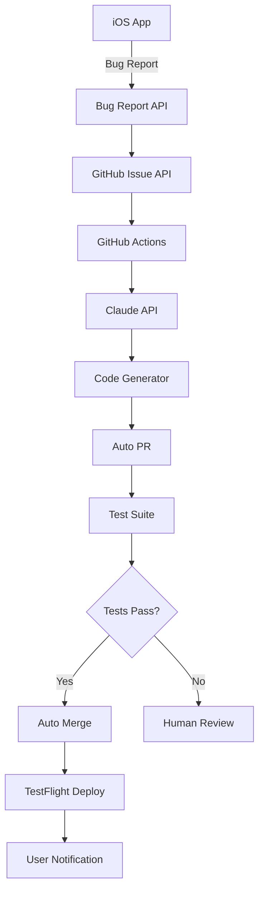

# 自動バグ修正システム 設計書

## 1. システムアーキテクチャ

### 1.1 全体構成



### 1.2 コンポーネント設計

#### 1.2.1 iOS アプリ側コンポーネント

**BugReportManager**
```swift
class BugReportManager {
    // シングルトン
    static let shared = BugReportManager()
    
    // バグ報告の収集
    func captureBugReport() -> BugReport
    
    // GitHub Issueの作成
    func submitBugReport(_ report: BugReport) async throws
    
    // ユーザー操作履歴の記録
    func trackUserAction(_ action: UserAction)
}
```

**BugReport モデル**
```swift
struct BugReport: Codable {
    let id: UUID
    let timestamp: Date
    let category: BugCategory
    let description: String?
    let screenshot: Data?
    let deviceInfo: DeviceInfo
    let appVersion: String
    let currentView: String
    let userActions: [UserAction]
    let logs: [LogEntry]
}

enum BugCategory: String, Codable {
    case buttonNotWorking = "button_not_working"
    case displayIssue = "display_issue"
    case appFreeze = "app_freeze"
    case dataNotSaved = "data_not_saved"
    case other = "other"
}
```

**BugReportView**
```swift
struct BugReportView: View {
    @State private var category: BugCategory = .other
    @State private var description = ""
    @State private var reproductionSteps = ""
    
    var body: some View {
        NavigationView {
            Form {
                // カテゴリ選択
                // 説明入力
                // 再現手順入力
                // 送信ボタン
            }
        }
    }
}
```

#### 1.2.2 GitHub Actions ワークフロー

**.github/workflows/auto-fix-bug.yml**
```yaml
name: Auto Fix Bug

on:
  issues:
    types: [opened, labeled]

jobs:
  analyze-and-fix:
    if: contains(github.event.issue.labels.*.name, 'auto-fix-candidate')
    runs-on: ubuntu-latest
    
    steps:
      - name: Checkout repository
        uses: actions/checkout@v4
        
      - name: Setup Python
        uses: actions/setup-python@v4
        with:
          python-version: '3.11'
          
      - name: Install dependencies
        run: |
          pip install anthropic
          pip install pygithub
          pip install pillow
          
      - name: Analyze issue
        id: analyze
        env:
          CLAUDE_API_KEY: ${{ secrets.CLAUDE_API_KEY }}
          GITHUB_TOKEN: ${{ secrets.GITHUB_TOKEN }}
        run: |
          python scripts/analyze_issue.py \
            --issue-number ${{ github.event.issue.number }}
            
      - name: Generate fix
        id: generate
        if: steps.analyze.outputs.can_auto_fix == 'true'
        run: |
          python scripts/generate_fix.py \
            --issue-number ${{ github.event.issue.number }} \
            --analysis "${{ steps.analyze.outputs.analysis }}"
            
      - name: Create fix branch
        if: steps.generate.outputs.has_fix == 'true'
        run: |
          git checkout -b fix/issue-${{ github.event.issue.number }}
          
      - name: Apply fix
        if: steps.generate.outputs.has_fix == 'true'
        run: |
          python scripts/apply_fix.py \
            --fix-data "${{ steps.generate.outputs.fix_data }}"
            
      - name: Run tests
        if: steps.generate.outputs.has_fix == 'true'
        run: |
          xcodebuild test \
            -scheme Delax100DaysWorkout \
            -destination 'platform=iOS Simulator,name=iPhone 14'
            
      - name: Create PR
        if: success()
        env:
          GITHUB_TOKEN: ${{ secrets.GITHUB_TOKEN }}
        run: |
          gh pr create \
            --title "Auto-fix: ${{ github.event.issue.title }}" \
            --body "Fixes #${{ github.event.issue.number }}" \
            --label "auto-generated"
```

#### 1.2.3 Claude API 統合

**scripts/analyze_issue.py**
```python
import anthropic
import json
import sys
from github import Github

class IssueAnalyzer:
    def __init__(self, claude_api_key, github_token):
        self.claude = anthropic.Client(api_key=claude_api_key)
        self.github = Github(github_token)
        
    def analyze_issue(self, issue_number):
        # GitHub Issueの取得
        issue = self._get_issue(issue_number)
        
        # スクリーンショットの解析
        screenshot_analysis = self._analyze_screenshot(issue)
        
        # ログの解析
        log_analysis = self._analyze_logs(issue)
        
        # Claudeによる総合分析
        analysis = self._claude_analyze(
            issue_body=issue.body,
            screenshot=screenshot_analysis,
            logs=log_analysis
        )
        
        return analysis
        
    def _claude_analyze(self, issue_body, screenshot, logs):
        prompt = f"""
        iOS アプリのバグ報告を分析してください。
        
        バグ報告内容:
        {issue_body}
        
        スクリーンショット分析:
        {screenshot}
        
        ログ:
        {logs}
        
        以下の形式で分析結果を返してください:
        {{
            "can_auto_fix": true/false,
            "confidence": 0-100,
            "bug_type": "カテゴリ",
            "affected_files": ["ファイルパス"],
            "root_cause": "原因の説明",
            "fix_strategy": "修正方針"
        }}
        """
        
        response = self.claude.messages.create(
            model="claude-3-opus-20240229",
            messages=[{"role": "user", "content": prompt}],
            max_tokens=1000
        )
        
        return json.loads(response.content[0].text)
```

**scripts/generate_fix.py**
```python
class FixGenerator:
    def generate_fix(self, issue_number, analysis):
        if not analysis['can_auto_fix']:
            return None
            
        # 影響を受けるファイルの内容を取得
        file_contents = self._get_file_contents(analysis['affected_files'])
        
        # 修正コードの生成
        fix = self._generate_fix_code(
            analysis=analysis,
            files=file_contents
        )
        
        return fix
        
    def _generate_fix_code(self, analysis, files):
        prompt = f"""
        以下のバグを修正するSwiftコードを生成してください。
        
        バグの原因: {analysis['root_cause']}
        修正方針: {analysis['fix_strategy']}
        
        現在のコード:
        {files}
        
        以下の制約を守ってください:
        - 最小限の変更
        - 既存のコードスタイルに従う
        - エラーハンドリングを適切に行う
        
        修正内容をJSON形式で返してください:
        {{
            "changes": [
                {{
                    "file": "ファイルパス",
                    "original": "元のコード",
                    "fixed": "修正後のコード"
                }}
            ]
        }}
        """
        
        response = self.claude.messages.create(
            model="claude-3-opus-20240229",
            messages=[{"role": "user", "content": prompt}],
            max_tokens=2000
        )
        
        return json.loads(response.content[0].text)
```

### 1.3 データフロー設計

#### 1.3.1 バグ報告フロー
1. ユーザーがアプリ内でバグを発見
2. シェイクジェスチャーでバグ報告画面を起動
3. カテゴリ選択と説明入力
4. スクリーンショット、ログ、デバイス情報を自動収集
5. GitHub Issue APIでIssue作成
6. 自動ラベル付け

#### 1.3.2 自動修正フロー
1. GitHub ActionsがIssue作成を検知
2. Claude APIでIssueを分析
3. 自動修正可能と判断された場合、修正コード生成
4. 新しいブランチで修正を適用
5. 自動テスト実行
6. テスト成功時、PRを自動作成
7. 追加の安全性チェック
8. 自動マージまたは人間のレビュー待ち

### 1.4 セキュリティ設計

#### 1.4.1 API キー管理
- GitHub Secrets で管理
- 環境変数経由でのアクセス
- ローテーション計画

#### 1.4.2 データプライバシー
- 個人情報のマスキング
- スクリーンショットの自動検査
- ログのサニタイズ

#### 1.4.3 修正の安全性
- サンドボックス環境での実行
- 変更量の制限
- 危険なパターンの検出

### 1.5 エラーハンドリング

#### 1.5.1 バグ報告の失敗
- ローカルキャッシュ
- リトライメカニズム
- オフライン対応

#### 1.5.2 自動修正の失敗
- 人間へのエスカレーション
- 詳細なエラーログ
- ロールバック機能

## 2. UI/UX 設計

### 2.1 バグ報告画面

```
┌─────────────────────────┐
│  バグを報告          ✕  │
├─────────────────────────┤
│ 何が起きましたか？       │
│ ┌─────────────────────┐ │
│ │ ◯ ボタンが効かない  │ │
│ │ ◯ 表示がおかしい    │ │
│ │ ◯ アプリが固まる    │ │
│ │ ◯ データが保存され  │ │
│ │   ない              │ │
│ │ ◉ その他            │ │
│ └─────────────────────┘ │
│                         │
│ 詳しく教えてください     │
│ ┌─────────────────────┐ │
│ │                     │ │
│ │                     │ │
│ └─────────────────────┘ │
│                         │
│ [スクリーンショット]     │
│  (自動で取得済み)        │
│                         │
│ ┌─────────┐ ┌─────────┐│
│ │キャンセル│ │  送信   ││
│ └─────────┘ └─────────┘│
└─────────────────────────┘
```

### 2.2 通知設計

#### 2.2.1 バグ修正完了通知
```
🎉 バグを修正しました！
報告いただいた「やったボタンが効かない」
問題を修正しました。アプリを更新して
ご確認ください。
```

#### 2.2.2 修正中通知
```
🔧 修正作業中...
報告いただいたバグを自動で修正中です。
完了次第お知らせします。
```

## 3. テスト設計

### 3.1 単体テスト
- BugReportManagerのテスト
- データ収集機能のテスト
- API通信のモックテスト

### 3.2 統合テスト
- エンドツーエンドのバグ報告フロー
- GitHub Actions ワークフローのテスト
- 自動修正の検証

### 3.3 受け入れテスト
- 実際のバグでの動作確認
- パフォーマンステスト
- ユーザビリティテスト

## 4. 監視・運用設計

### 4.1 メトリクス
- バグ報告数
- 自動修正成功率
- 修正時間
- ユーザー満足度

### 4.2 アラート
- API エラー率上昇
- 自動修正失敗の増加
- コスト超過警告

### 4.3 ダッシュボード
- リアルタイム状況
- 統計情報
- コスト追跡