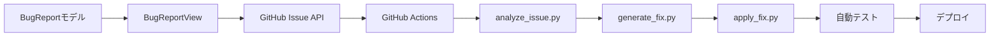

# 自動バグ修正システム 実装計画書

## 1. 実装フェーズ

### フェーズ1: 基盤構築（Week 1）
#### 目標
アプリ内バグ報告機能の基本実装とGitHub Issue連携

#### タスク
1. **BugReportモデルの実装**
   - データモデル定義
   - ユーザー操作履歴の記録機能

2. **BugReportViewの実装**
   - UI実装
   - スクリーンショット自動取得
   - シェイクジェスチャー検知

3. **GitHub Issue API連携**
   - Issue作成機能
   - 画像アップロード
   - 自動ラベル付け

#### 成果物
- 動作するバグ報告機能
- GitHub Issueの自動作成

### フェーズ2: 自動分析システム（Week 2）
#### 目標
Claude APIを使用したバグ分析機能の実装

#### タスク
1. **GitHub Actions基本設定**
   - ワークフローファイル作成
   - シークレット設定

2. **analyze_issue.pyスクリプト**
   - Issue内容の解析
   - スクリーンショット分析
   - 自動修正可否の判定

3. **安全性ルールの実装**
   - 修正可能範囲の定義
   - 危険パターンの検出

#### 成果物
- Issue分析レポート生成
- 自動修正可否の判定機能

### フェーズ3: 自動修正機能（Week 3）
#### 目標
コード生成と自動PR作成機能の実装

#### タスク
1. **generate_fix.pyスクリプト**
   - 修正コード生成
   - ファイル差分作成

2. **apply_fix.pyスクリプト**
   - ブランチ作成
   - 修正適用
   - コミット作成

3. **自動テスト統合**
   - テスト実行
   - 結果判定

#### 成果物
- 自動修正PR作成機能
- テスト統合

### フェーズ4: 安全性強化とデプロイ（Week 4）
#### 目標
本番環境への展開と監視機能の実装

#### タスク
1. **追加の安全性チェック**
   - コードレビューbot
   - 変更量制限
   - ロールバック機能

2. **TestFlightデプロイ統合**
   - 自動デプロイ設定
   - ユーザー通知

3. **監視ダッシュボード**
   - メトリクス収集
   - アラート設定

#### 成果物
- 本番稼働可能なシステム
- 運用監視環境

## 2. 実装順序と依存関係

## 3. 技術スタック

### iOS アプリ側
- **言語**: Swift 5.9
- **UI**: SwiftUI
- **データ**: SwiftData
- **ネットワーク**: URLSession
- **画像処理**: UIKit

### サーバー側
- **CI/CD**: GitHub Actions
- **スクリプト**: Python 3.11
- **AI**: Claude API (Anthropic)
- **バージョン管理**: Git

### 外部サービス
- **Issue管理**: GitHub Issues
- **デプロイ**: TestFlight
- **監視**: GitHub Insights

## 4. リスク管理

### 技術的リスク
| リスク | 影響度 | 発生確率 | 対策 |
|--------|--------|----------|------|
| Claude API障害 | 高 | 低 | フォールバック、手動対応 |
| 誤った修正 | 高 | 中 | テスト強化、段階的展開 |
| API利用上限 | 中 | 中 | レート制限、優先度設定 |

### スケジュールリスク
| リスク | 影響度 | 発生確率 | 対策 |
|--------|--------|----------|------|
| 実装遅延 | 中 | 中 | バッファ確保、スコープ調整 |
| テスト不足 | 高 | 低 | 自動テスト重視 |

## 5. 段階的リリース計画

### Stage 1: 内部テスト（Week 4）
- 開発チーム内でのテスト
- 基本的なバグでの動作確認
- フィードバック収集

### Stage 2: ベータテスト（Week 5）
- 限定ユーザーへの展開
- nil参照エラーのみ自動修正
- 成功率の測定

### Stage 3: 段階的展開（Week 6-7）
- 修正範囲の拡大
- 全ユーザーへの展開
- 継続的な改善

### Stage 4: 完全自動化（Week 8+）
- より複雑なバグへの対応
- 機械学習モデルの導入
- 予防的バグ検出

## 6. 成功指標

### 短期目標（1ヶ月）
- バグ修正時間: 50%削減
- 自動修正成功率: 70%以上
- ユーザー満足度: 4.0/5.0

### 中期目標（3ヶ月）
- バグ修正時間: 80%削減
- 自動修正成功率: 85%以上
- 開発効率: 30%向上

### 長期目標（6ヶ月）
- 予防的バグ検出
- 自動修正範囲の拡大
- 他プロジェクトへの展開

## 7. チーム体制

### 必要なリソース
- iOS開発者: 1名（フルタイム）
- バックエンド開発者: 1名（50%）
- QAエンジニア: 1名（25%）

### 役割分担
- **iOS開発者**: アプリ側機能実装
- **バックエンド開発者**: GitHub Actions、Python スクリプト
- **QAエンジニア**: テスト設計、品質保証

## 8. コミュニケーション計画

### 定例会議
- 週次進捗会議
- デイリースタンドアップ（実装期間中）

### ドキュメント
- 技術仕様書の更新
- 運用手順書の作成
- ユーザーガイド

### ステークホルダー報告
- 経営層への月次報告
- ユーザーへのリリースノート

## 9. 予算見積もり

### 開発コスト
- 人件費: 4週間 × 1.75人月
- インフラ: GitHub Actions（無料枠内）

### 運用コスト
- Claude API: 月額 $200程度（推定）
- 監視ツール: 既存環境を利用

### ROI
- バグ修正工数削減: 月40時間
- ユーザー満足度向上による解約率低下

## 10. 次のステップ

1. **承認取得**
   - 技術レビュー
   - 予算承認

2. **環境準備**
   - 開発環境セットアップ
   - APIキー取得

3. **キックオフ**
   - チーム編成
   - 実装開始